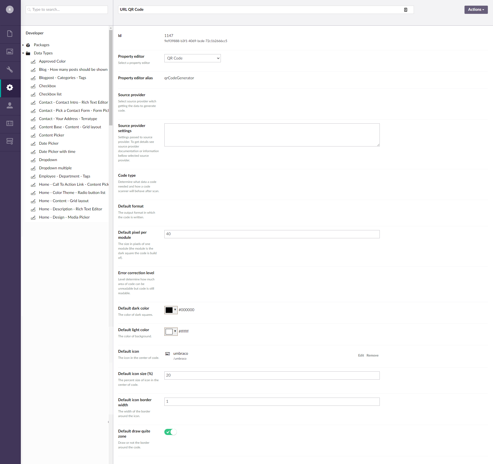
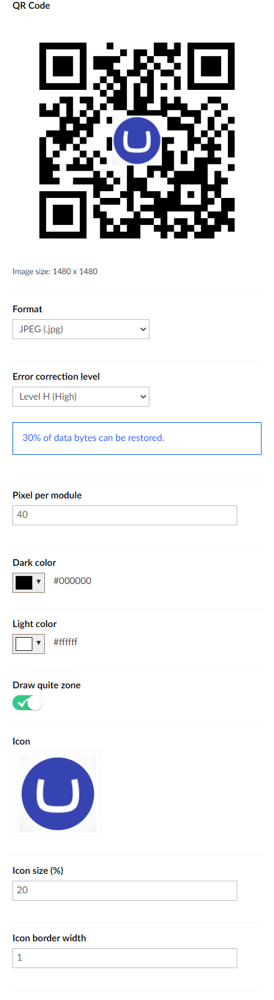


# QR Code Generator

[](https://our.umbraco.com/packages/backoffice-extensions/qr-code-generator/) 
[](https://dev.azure.com/robolynx/RoboLynx.Umbraco.QRCodeGenerator/_build/latest?definitionId=7&branchName=main-u10)


## Description

_Property editor_ and _Content app_ for **Umbraco 10** allowing to generate QR codes straight from code, Umbraco Backoffice and frontend page. 

> * Version for Umbraco 9 is [here](https://github.com/sebafelis/RoboLynx.Umbraco.QRCodeGenerator/tree/main-u9)
> * Version for Umbraco 8 is [here](https://github.com/sebafelis/RoboLynx.Umbraco.QRCodeGenerator/tree/main-u8)
> * Version for Umbraco 7 is [here](https://github.com/sebafelis/RoboLynx.Umbraco.QRCodeGenerator/tree/main-u7)
 
User can customize generated code by color, size, output format, error correction level, adding quiet zone and also by adding icon (not for all formats). Code is available to generated from specify document type, base on specify data source like current document property or URL. The source from where the code content is get, the code type and the document type from which code can be generated are specify by developer. At this moment data source it can be property of current document (or part of it selected by regular expression), document URL or custom ([see **Source providers**](#source-providers)).

Since `version 8.1` QR code can be insert on to frontend page. Generated codes are also cached. Backoffice and frontend use separate cache for secure reasons.


## Table of Contents

1. [Installation](#installation)
1. [Configuration](#configuration)
1. [Configuration file](#configuration-file)
1. [Using in Umbraco Backoffice](#using-in-umbraco-backoffice)
1. [Cache](#cache)
1. [Using on frontend page](#using-on-frontend-page)
   * [Secure URL](#secure-url)
1. [Frontend cache](#frontend-cache)
1. [Using service](#using-service)
   * [Dependency Injection](#dependency-injection)
1. [Source providers](#source-providers)
   a) [Content Property](#content-property)
   b) [Absolute URL](#absolute-url)
   c) [Custom](#custom)
1. [Code Types](#code-types)
1. [Formats](#formats)
1. [Use examples](#use-examples)

## Installation

> **Attention!**
> 
> Packages with version starts from:
> * 7.* are intended for Umbraco 7.
> * 8.* are intended for Umbraco 8.
> * 9.* are intended for Umbraco 9.
> * 10.* are intended for Umbraco 10.

Install RoboLynx.Umbraco.QRCodeGenerator by NuGet calling the following command in your main project:

```Install-Package RoboLynx.Umbraco.QRCodeGenerator -Version VERSION_NUMBER```

and choose what other packages you need to from bellow table.

Package name | Description | NuGet link
-------------|------------|------------
RoboLynx.Umbraco.QRCodeGenerator.Core | Project core  | [](https://www.nuget.org/packages/RoboLynx.Umbraco.QRCodeGenerator.Core/)
RoboLynx.Umbraco.QRCodeGenerator | Property editor for Umbraco backoffice [[more](#using-in-umbraco-backoffice)] | [](https://www.nuget.org/packages/RoboLynx.Umbraco.QRCodeGenerator/) 
RoboLynx.Umbraco.QRCodeGenerator.Cache | Cache implementation [[more](#cache)] | [](https://www.nuget.org/packages/RoboLynx.Umbraco.QRCodeGenerator.Cache/)
RoboLynx.Umbraco.QRCodeGenerator.Cache.Local | Default cache configuration for property editor [[more](#cache)] | [](https://www.nuget.org/packages/RoboLynx.Umbraco.QRCodeGenerator.Cache.Local/)
RoboLynx.Umbraco.QRCodeGenerator.Frontend | Controller for frontend page and property editor converter [[more](#using-on-frontend-page)] | [](https://www.nuget.org/packages/RoboLynx.Umbraco.QRCodeGenerator.Frontend/)
RoboLynx.Umbraco.QRCodeGenerator.Frontend.Cache.Local | Default cache configuration for frontend page [[more](#frontend-cache)] | [](https://www.nuget.org/packages/RoboLynx.Umbraco.QRCodeGenerator.Frontend.Cache.Local/)

## Configuration

1. Create a new Data type under the Settings tab and select **QR Code**
1. Select data source
1. Set **Source provider settings** field ([see here](#source-providers))
1. Select **Code type**
1. Set default settings (all settings with prefix Default can be customize by backoffice user in when generating code but this value will be set up when user select this code type).
1. Save data type
1. Edit or create document type where you wont you **QR Code Generator**
1. Add new property and select created before data type. Remember! Document type has to have all property names defined in **Source provider settings**. 
1. Save document type. 

   

## Configuration file 

Some global settings can be configure from *appsetting.json* file. Default configuration looks like below.

```json
{
    "QRCodeGenerator": {
        "Cache": {
          "Backoffice": { // Settings for cache storing requests from backoffice property editors.
            "Disable": false, // Disable this cache.
            "MaxDays": 365,  // How many days file in cache will be store
            "DelayCleanCache": "0.0:1:0", // Delay before first running of cache clearing service. Is running only on master server. Default value: 1 minute.
            "PeriodCleanCache": "0.1:0:0" // Period between running cache clearing service. Is running only on master server. Default value: 1 day.
          },
          "Frontend": { // Settings for cache storing requests from frontend page
            "Disable": false, // Disable this cache.
            "MaxDays": 365, // How many days file in cache will be store
            "DelayCleanCache": "0.0:1:0", // Delay before first running of cache clearing service. Is running only on master server. Default value: 1 minute.
            "PeriodCleanCache": "0.1:0:0" // Period between running cache clearing service. Is running only on master server. Default value: 1 day  .
          }
        },
        "FrontendApi": { 
          "Disable": false // Disable access to frontend API. Display generated QR codes on frontend page will not be possible. 
          "OnlyEncryptedCalls": false // If true only encrypted calls of frontend API will be accepted.
        }
    }
}
```

>`DelayCleanCache` and `PeriodCleanCache` are write as TimeSpan. Read more on [https://docs.microsoft.com/en-us/dotnet/api/system.timespan.parse](https://docs.microsoft.com/en-us/dotnet/api/system.timespan.parse)
 

## Using in Umbraco Backoffice

1. After configuration you can open or create document of type where you add QR Code Generator property.
1. If document is published you will see active QR Code icon between content icon and info icon. Click them.
1. HearUmbraco backoffice users can create QR codes and download them.
   
    

## Cache

To caching generated QR codes you need to install `RoboLynx.Umbraco.QRCodeGenerator.Cache` package.
This package contains all base classes needed to setup cache. You can use it to create your own cache configuration.

If you wont to cache all generated QR codes in local file system just install `RoboLynx.Umbraco.QRCodeGenerator.Cache.Local` package. It's ready-to-use cache configuration.

This package configure automatically cache for all requests from Umbraco Backoffice (making by __QR Code Generator__ property editor) and store all in the local file system.

> **Attention!**
>
> For frontend page you need to configure separate cache for secure reasons.

## Using on frontend page

You can display on your website a QR code generated from the configured document property (as above).

To do this you can to use `GetQRCodeUrl()` method from UrlHelper for MVC in razor template. 

```html

```

Insert the above code to your razor template in place where you wont to see QR code (`SomeQRCodeProperty` is an example name, replace to you own name). 
`GetQRCodeUrl()` method has also another parameters to customize settings or content culture. If you use overloaded method without this parameters, it's use default settings or/and current document culture.

> **Remember!**
> 
> `GetQRCodeUrl()` return URL to the file with generated code. If you specify custom format that it isn't image format supported by browsers you must customize this code.

### Secure URL

Until version 9.1 is available also `GetSecureQRCodeUrl()` method. The difference between this and previous method is `GetSecureQRCodeUrl()` return a URL with encrypted parameters. This method occurs prevent modify QR code and can prevent from unwonted server load that can be use to DoS attack.

> **Attention!**
>
> To actually really prevent DoS attack set up `OnlyEncryptedCalls` in [configuration file](#configuration-file) to disable possibility of calls an unencrypted API. When this setting is turn on the `GetQRCodeUrl()` method will take the same result as `GetSecureQRCodeUrl()`.

> **Important**!
> 
>To encrypt request URL's parameters `GetSecureQRCodeUrl()` method use [**Data Protection**](https://docs.microsoft.com/en-us/aspnet/core/security/data-protection/introduction) build in to ASP.NET Core. It's a cryptographic API generating and storing cryptography key. In **production** version you probably will want to configure key storage other then default to prevent lose data. To do this read more **[here](https://docs.microsoft.com/en-us/aspnet/core/security/data-protection/configuration/)**.

### Frontend cache 

For secure reason frontend package has a separate cache.

If you don't use separate file storage, you should install `RoboLynx.Umbraco.QRCodeGenerator.Frontend.Cache.Local` package. Like `RoboLynx.Umbraco.QRCodeGenerator.Frontend.Cache.Local` also this package is a ready-to-use cache configuration using the local file system.

```Install-Package RoboLynx.Umbraco.QRCodeGenerator.Frontend.Cache.Local -Version VERSION_NUMBER```

> **Attention!**
>
> If you don't install this package all requests from frontend will not be cached. It's may have a negative impact on the performance of your website.

## Using service

You can get access to data generated by QR Code Generator in your own code through the service.

Through the service you can:
* Get stream containing generate QR code by passing the **QR Code Generator** property or by passing your own value of the code content through an object of type implementing `IQRCodeType` [(see **Code Types**)](#code-types). (`GetStream()`)
* Get default settings for the specify **QR Code Generator** data type by the content property. (`GetDefaultSettings()`)
* Clear data stored in cache (`ClearCache()`)

### Dependency Injection

You may able to use **Dependency Injection**. For instance if you have registered your own class in Umbraco's dependency injection, you can specify the `IQRCodeService` interface in your constructor:

```c#
public class MyClass
{

    private readonly IQRCodeService _qrCodeService;
    
    public MyClass(IQRCodeService qrCodeService)
    {
        _qrCodeService = qrCodeService;
    }
}
```

## Source providers

Source provider gets data from specify source and pass it to attributes containing by **Code type**. Now we have available only two build-in source providers. But you can write your own.

### a) Content Property

It's get data from content property by property name. Configuration is required. 
Configuration can by write on two way:
  1. Property names separated by commas. i.e. `propertyName1, propertyName2, propertyName3`.
    When you use this syntax you must remember then property names order is important. Values will be pass to QR Code type as attributes by index.
    This syntax may also contain regular expression (just after property name between double curly brackets `{{\d*}}`) witch can extract only part of property value. Regular expression is optional. e.g:

        ```
        location{{^\d*(\.\d*)?}}, location{{(?<=,)\d*(\.\d*)?(?=,)}}
        ```

  1. JSON syntax. e.g: 
        ```json
        { 
            properties: {
                atributeName1: {
                    name: "propertyName1",
                    regex: "\d*"
                },
                atributeName2: "propertyName2"
        }
        ```
        When you use this syntax property value is pass to **Code type** as attributes by attribute name. Check attribute names [hear](#code-types). You can find them also in information bellow selected **Code type** filed in backoffice.

### b) Absolute URL

It's always passing absolute document URL for each attribute of **Code type**. That's way this source provider should be use only with **URL Code type** ([see **Code Types**](#code-types)).

### c) Custom

You can write your own **Code type** writing a two classes. First needs Implementing IQRCodeSourceFactory and second implementing IQRCodeSource. 

For example you can wrote source provider getting data from external web service.

## Code Types

The setting defines what type of data will be passed on to the end user and how it will be displayed to him. 

Available build-in types:

* **Text** _(`TextType` class)_ - After user will scan the code it will saw specify text in code scanner. *Argument: `text`*
* **Phone number** _(`PhoneNumberType` class)_ - After user will scan the code it will saw specify phone number ready to call. *Argument: `number`*
* **URL** _(`UrlType` class)_ - After user will scan the code it will open specify resource in default application for specify protocol. i.e. specify website in default browser if protocol will bee _HTTP_ or _HTTPS_. *Argument: `url`*
* **SMS** _(`SmsType` class)_ - After user will scan the code it will saw new SMS message with specific content ready to send on specific number. *Arguments: `number`, `subject`*
* **Geo-location (Google Map)** _(`GeolocationGooleMapType` class)_ - After user will scan the code it will open Google Maps application or website with pinned specify position. *Arguments: `latitude`, `longitude`*
* **Geo-location (GEO)** _(`GeolocationGEOType` class)_ - After user will scan the code it will open default map application with pinned specify position. *Arguments: `latitude`, `longitude`*
* **Custom** - You can also write your own **Code type** writing a class extending `QRCodeType` class.

## Formats

Output format of generated file.

Supported formats:
* **svg**
* **jpg** (with icon support)
* **png** (with icon support)
* **bmp** (with icon support)
* **Custom** - You can make your own output format writing a new class extending `QRCodeFormat` class. 

> **Attention!**
> 
> Custom format must be readable by \ element otherwise preview in umbraco backoffice will be not available.

## Use examples

### 1. QR Code with geographic position easy to change:

#### The expected result:
When user scan the code then will see position on map in default map application. Position is easy to set on map in Umbraco Backoffice. 
    
#### How to achieve this result:
To achieve the aim you can use the property editor like [**Our.Umbraco.OsmMaps**](https://our.umbraco.com/packages/backoffice-extensions/openstreetmap-property-editor/) to change geographic position on the map in Umbraco Backoffice. 
* Install **Our.Umbraco.OsmMaps**
* In some Document Type (for this example I use Document Type named _ItemLocation_) add new property with alias _location_ and select **Open street maps** editor.
* Create new Data Type in Umbraco backoffice, set name _Code with location_ and select **QR Code** as **Property editor** ([see Configuration](#configuration)). 
* In **Source provider** field select **Content Property** to get the data for code from other properties in document.
* Next select **Geo-location (GEO)** in **Code type** field. This **Code type** needs two arguments, the latitude and the longitude attributes. 
However **Open Street Map** editor save latitude and longitude in one string like `53.35055131839989,18.74267578125,7`. 
* To get the data for two attributes from one property you need to use Regular Expression in **Source provider settings**.
Correct **Source provider settings** for this instant should looks like this: 
    
    ```
    location{{^\d*(\.\d*)?}}, location{{(?<=,)\d*(\.\d*)?(?=,)}}
    ```
    
    At above, _location_ is documents property alias. Inside double brace is regular expression extracting first number value from string and after delimiter is expression for second attribute which extract second number from string in _location_ property. 

    **Source provider settings** can be also write in JSON syntax like bellow (you can choose syntax):

    ```json
    { 
        properties: {
            latitude: {
                name: "location",
                regex: "^\d*(\.\d*)?"
            },
            longitude: {
                name: "location",
                regex: "(?<=,)\d*(\.\d*)?(?=,)"
            }
    }
    ```

* Now add new property to the same Document Type as before, set property name and choose data type what you created at the moment.
* Go to the Content tab 
* Create new document of type _ItemLocation_. 
* Set name and location on map, 
* Save document
* Click QR Code icon in the left top corner. 
* Here you can see the generated QR code, change settings and **download** it.


